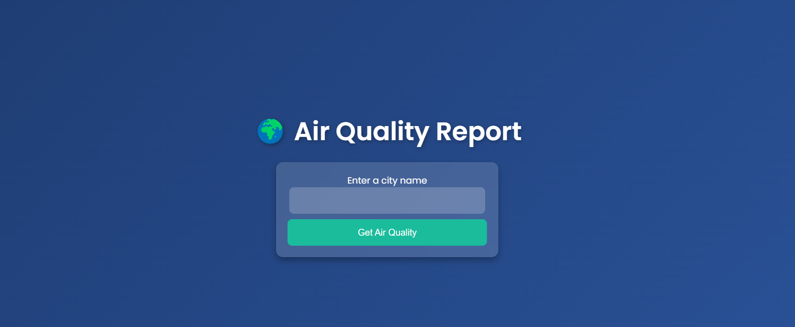
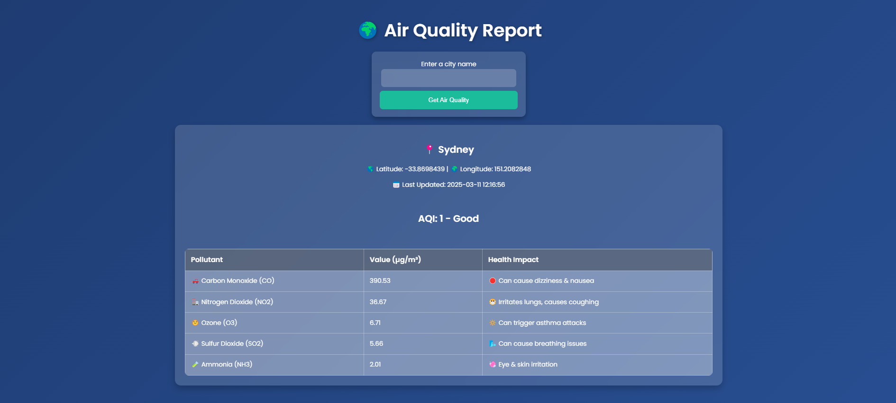

# Air Quality Data Pipeline

## Project Overview
This project is a **Flask-based air quality monitoring system**. It retrieves real-time air pollution data from the **OpenWeatherMap API**, stores it in an **Azure SQL Database**, and provides a simple web interface to visualize the data.

### Key Objectives:
- Fetch real-time air quality data from OpenWeatherMap API.
- Store and manage data in **Azure SQL Database**.
- Provide a **Flask-based web interface** for data visualization.
- Deploy and manage the application on **Azure App Service**.

---

## Features
**Flask Web Application** - Backend API and frontend in Flask.  
**Automated Data Fetching** - Retrieves air quality data from OpenWeather API.  
**Azure SQL Database** - Stores processed data securely in the cloud.  
**Simple & Interactive UI** - Uses HTML, CSS, and Flask templates.  
**Cloud Deployment** - Deploy on **Azure App Service**.  

---

## Project Structure
```
air-quality-data-pipeline/
│── backend/              # Flask Backend
│   ├── app.py            # Flask application entry point
│   ├── database_config.py # Azure SQL Database configuration
│   ├── database_operations.py # Handles database interactions
│   ├── fetch_data.py      # Fetches air quality data from OpenWeatherMap API
│   ├── requirements.txt   # Python dependencies for the backend
│── frontend/             # Frontend for Flask templates & static files
│   ├── templates/        # HTML files for UI
│   │   ├── index.html    # Main web dashboard
│   ├── static/           # CSS, JavaScript, images
│   │   ├── styles.css    # CSS file for styling
│── requirements.txt      # Project-wide dependencies
│── README.md             # Documentation
│── screenshots/          # Folder for UI screenshots
```

---

## ⚙Technologies Used
- **Backend**: Python (Flask) 
- **Database**: **Azure SQL Database** (for structured data storage)
- **Frontend**: Flask Templates (HTML, CSS)
- **APIs**: OpenWeatherMap API (for air quality data)
- **Cloud Services**: **Azure App Service for hosting**
- **Deployment**: Flask App on Azure

---

## Installation & Setup

### Clone this repository:
```sh
git clone https://github.com/yourusername/air-quality-data-pipeline.git
cd air-quality-data-pipeline
```

### Set up a virtual environment and install dependencies:
```sh
cd backend
python -m venv venv
source venv/bin/activate  # On Windows use `venv\Scripts\activate`
pip install -r requirements.txt
```

### Configure the Azure Database connection:
- Update `database_config.py` with **Azure SQL Database** credentials.
- Example:
  ```python
  DATABASE_CONFIG = {
      "server": "your-azure-server.database.windows.net",
      "database": "air_quality_db",
      "username": "your_username",
      "password": "your_password"
  }
  ```

### Run the database setup:
```sh
python database_operations.py
```

### Start the Flask backend application:
```sh
python app.py
```

### Open the web dashboard:
- Open a web browser and go to `http://127.0.0.1:5000/`

---

## Data Sources
- **API Used**: OpenWeatherMap API for real-time air quality data.
- **Cloud Database**: Azure SQL Database.
- **Data Format**: JSON.

---

## Screenshots
| Web Dashboard | Data Overview |
|--------------|--------------|
|  |  |


---

## Contact
For inquiries or suggestions, feel free to reach out:
- **Email:** simimathew1898@gmail.com
- **GitHub:** https://github.com/simimathew1898
